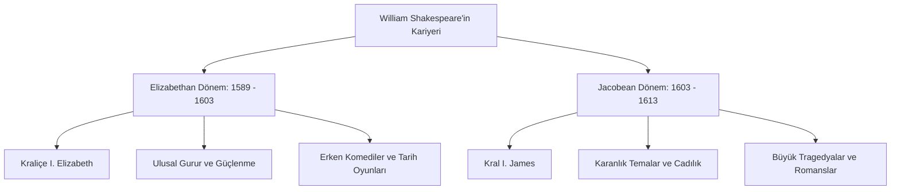

# William Shakespeare: Biyografi ve Tarihsel Bağlam

William Shakespeare (1564 – 1616), yalnızca İngiliz edebiyatının değil, dünya dramaturjisinin en önemli figürlerinden biridir. Bu çalışmada, Ozan'ın yaşam öyküsü, Stratford-upon-Avon'daki köklerinden Londra sahnesinin zirvesine uzanan yolculuğu ve eserlerini şekillendiren tarihsel, kültürel ve toplumsal koşullar incelenmektedir.

---

## 1. Stratford-upon-Avon'dan Londra Sahnelerine: Yaşam Öyküsü

### İlk Yıllar ve Eğitimi
Shakespeare, Nisan 1564'te Stratford-upon-Avon'da doğdu (Vaftiz tarihi 26 Nisan 1564'tür). Babası John Shakespeare varlıklı bir deri tüccarı ve belediye meclisi üyesi (alderman), annesi Mary Arden ise saygın bir toprak sahibi ailenin kızıydı. Shakespeare'in Stratford'daki *King's New School* adlı yerel gramer okulunda eğitim gördüğü tahmin edilmektedir. Burada yoğun bir Latince, klasik edebiyat ve retorik eğitimi almıştır; bu altyapı oyunlarındaki mitolojik ve tarihi atıfların zeminini oluşturmuştur.

### Evliliği ve "Kayıp Yıllar"
1582 yılında, 18 yaşındayken, kendisinden sekiz yaş büyük olan Anne Hathaway ile evlendi. Bu evlilikten Susanna adında bir kızları ve Hamnet ile Judith adında ikiz çocukları oldu. Hamnet 11 yaşındayken vefat etti; bu kaybın Shakespeare'in özellikle *Hamlet* ve *Kral John* gibi oyunlarındaki melankoli ve yas temalarında derin izler bıraktığı düşünülür. 1585 ile 1592 yılları arası, Shakespeare'in hayatına dair hiçbir belgenin bulunmadığı ve "Kayıp Yıllar" (Lost Years) olarak adlandırılan dönemdir.

### Londra'da Yükseliş ve Globe Tiyatrosu
1592'de Shakespeare artık Londra'da tanınan bir oyun yazarı ve oyuncuydu. Dönemin oyun yazarlarından Robert Greene, ünlü *Groats-Worth of Wit* broşüründe Shakespeare'i "sonradan görme bir karga" (an upstart crow) olarak nitelendirerek kıskançlığını dile getirmiştir. 
Shakespeare, 1594 yılında kurulan *Lord Chamberlain's Men* (Kraliçe Elizabeth'in ölümünden sonra *King's Men* adını alacaktır) topluluğunun kurucu ortağı, baş oyun yazarı ve oyuncusu oldu. Topluluk, 1599 yılında Thames Nehri'nin güney kıyısında kendi tiyatroları olan **Globe**'u inşa etti. Shakespeare bu yatırımla büyük bir servet kazandı ve memleketi Stratford'da *New Place* adlı malikaneyi satın aldı. 1616 yılında memleketinde öldü ve Holy Trinity Kilisesi'ne gömüldü.

---

## 2. Çağdaş Dönem: Elizabeth ve Jacobean Çağları

Shakespeare'in kariyeri iki büyük hükümdarın saltanatına yayılır: Kraliçe I. Elizabeth (Tudor Hanedanı, 1558-1603) ve Kral I. James (Stuart Hanedanı, 1603-1625).

### Elizabethan Altın Çağı (1558 – 1603)
I. Elizabeth dönemi, İngiltere'nin İspanyol Armada'sını yenilgiye uğratarak (1588) bir deniz gücü haline geldiği, kültürel ve ekonomik olarak yükselişe geçtiği bir "Altın Çağ"dır. Bu dönemde yazılan oyunlar ulusal gururu, monarşinin meşruiyetini ve Tudor propagandasını yansıtır (*Henry V* ve *Richard III* gibi). Hümanizm akımı ve coğrafi keşifler edebiyatı zenginleştirmiştir.

### Jacobean Dönem ve Politik İstikrarsızlık (1603 – 1625)
Kraliçe'nin varissiz ölümüyle İskoçya Kralı VI. James, I. James adıyla İngiltere tahtına çıktı. Bu geçiş, dinsel çatışmaları ve suikast girişimlerini beraberinde getirdi (1605 Barut Komplosu - Gunpowder Plot). Bu istikrarsızlık, Shakespeare'in Jacobean dönemindeki oyunlarının tonunu belirgin şekilde kararttı. *Macbeth*, *Kral Lear* ve *Othello* gibi büyük tragedyalar bu dönemin ürünüdür. I. James'in demonolojiye (cadılık ve büyücülük araştırmaları) olan ilgisi, doğrudan *Macbeth* oyunundaki cadılar figüründe hayat bulmuştur.

---

## 3. Veba Salgınları ve Tiyatronun Kapanması

16. ve 17. yüzyıllarda Londra, sık sık bubonik veba (Kara Ölüm) salgınlarının hedefi olmuştur. Kalabalık nüfus ve hijyen eksikliği nedeniyle hastalık hızla yayılıyordu.

- **Tiyatro Yasakları:** Belediye meclisi, vebanın yayılmasını önlemek amacıyla haftalık vefat sayısı belirli bir eşiği (genellikle 30-40 vefat) aştığında tüm tiyatroları kapatma yetkisine sahipti. 1592-1594 ve 1603-1604 yıllarında tiyatrolar uzun süre kapalı kaldı.
- **Şiire Yöneliş:** Tiyatroların kapalı olduğu dönemlerde gelir kapısı kapanan Shakespeare, hamisi Southampton Kontu Henry Wriothesley'e ithaf ettiği *Venus and Adonis* (1593) ve *The Rape of Lucrece* (1594) gibi uzun anlatı şiirlerini yazdı. 154 sonesinin önemli bir kısmını da bu karantina dönemlerinde kaleme aldığı düşünülmektedir.

---

## 4. Kaynaklar ve Akademik Atıflar

- **Greenblatt, Stephen.** *Will in the World: How Shakespeare Became Shakespeare*. W. W. Norton & Company, 2004.
- **Kermode, Frank.** *Shakespeare's Age*. Modern Library, 2004.
- **Shapiro, James.** *1599: A Year in the Life of William Shakespeare*. Faber and Faber, 2005.
