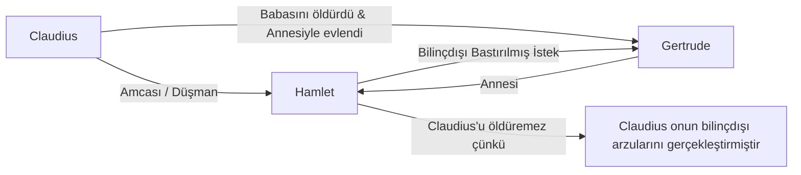

# Hamlet: Eylemsizlik, Delilik ve Varoluşsal Kriz

*Hamlet, Danimarka Prensi Trajedisi*, William Shakespeare'in en uzun, en çok tartışılan ve modern tiyatro ile felsefe üzerinde en derin izleri bırakmış oyunudur. Yaklaşık 1600-1601 yıllarında yazılan bu eser, intikam trajedisi (revenge tragedy) kalıplarını kullanarak insan bilincinin en karmaşık labirentlerini keşfeder.

---

## 1. Gecikme Sorunsalı: Eylem ile Düşünce Arasındaki Uçurum

Hamlet, babasının hayaletinden Claudius'un onu zehirleyerek öldürdüğünü ve tahtı gasbettiğini öğrendikten sonra intikam yemini eder. Ancak oyunu beş perdeden oluşan devasa bir yapıya dönüştüren unsur, Hamlet'in bu eylemi sürekli **ertelemesidir** (procrastination).

- **Entelektüel Felç:** Hamlet, bir Rönesans entelektüelidir (Wittenberg Üniversitesi'nde eğitim görmüştür). Onun eyleme geçememesinin sebebi korkaklık değil, eylemin ahlaki, felsefi ve metafizik sonuçlarını aşırı derecede düşünmesidir. Claudius'u dua ederken gördüğü sahne (Perde III, Sahne III) bu durumun en somut örneğidir: Onu dua ederken öldürürse ruhunun cennete gideceğinden korkarak duraksar.
- **Vicdanın Rolü:** Kendi eylemsizliğini sorguladığı ünlü tiradında bu ikilemi açıkça dile getirir:
  > *"Böylece bilincimiz bizi korkak kılıyor, / Ve kararlılığın o doğal canlılığı, / Soluk bir düşünce gölgesiyle marazlaşıyor..."*  
  > — **Hamlet, Perde III, Sahne I, Satır 83-85**

---

## 2. Deliliğin Doğası: Gerçek mi, Stratejik mi?

Hamlet, saraydaki düşmanlarını şaşırtmak ve planlarını gizlemek amacıyla "deli taklidi" yapacağını (antic disposition) arkadaşı Horatio'ya bildirir (Perde I, Sahne V). Ancak oyun ilerledikçe bu taklit ile gerçek delilik arasındaki sınır muğlaklaşır.

- **Polonius'un Gözlemi:** Saray nazırı Polonius, Hamlet'in konuşmalarındaki mantığı sezer:
  > *"Bu bir delilik olsa da içinde bir yöntem var."*  
  > — **Hamlet, Perde II, Sahne II, Satır 205-206**
- **Melankoli ve Varoluşçu Çöküş:** Hamlet'in deliliği, klinik bir patolojiden ziyade, dünyanın anlamsızlığına ve insanlığın yozlaşmışlığına karşı duyduğu derin bir tiksintidir. Annesi Gertrude'un, babasının ölümünün hemen ardından amcasıyla evlenmesi, onda kadınlara ve genel olarak varoluşa karşı inançsızlık yaratır. Ophelia'ya karşı takındığı sert tavır ve *"Git bir manastıra kapat kendini!"* (Perde III, Sahne I) haykırışı bu çöküşün yansımasıdır.

---

## 3. Psikanalitik Okuma: Oedipus Kompleksi

Sigmund Freud ve onun takipçisi Ernest Jones, Hamlet'in erteleme davranışını psikanalitik bir temele oturtmuştur:

- **Bilinçdışı Özdeşleşme:** Bu teoriye göre Hamlet, Claudius'u öldüremez; çünkü Claudius, Hamlet'in kendi çocukluğunda bastırdığı Oedipal arzuları (babayı öldürüp anneye sahip olma) gerçeğe dönüştürmüştür. Claudius'u cezalandırmak, kendi bilinçdışı arzularını cezalandırmak anlamına geleceği için Hamlet içsel bir suçluluk ve felç durumu yaşar.

---

## 4. İnsanın Konumu ve Varoluşçuluk

Hamlet, varoluşçu felsefenin (Sartre, Camus, Kierkegaard) habercisi niteliğindedir. İnsanın evrendeki yalnızlığını, ahlaki seçimlerinin ağırlığını ve ölümün kaçınılmazlığını sorgular. Mezarlık sahnesinde (Perde V, Sahne I) saray soytarısı Yorick'in kafatasını eline aldığında, tüm ihtişamın, güzelliğin ve zekanın sonunda bir avuç toza dönüşeceği gerçeğiyle yüzleşir.

İnsanın yüceliği ve eşzamanlı olarak hiçliği üzerine yaptığı şu konuşma, hümanizm ile nihilizm arasındaki gerilimi özetler:
> *"Ne muazzam bir eserdir insan! Ne kadar asil bir akıl! Ne kadar sonsuz yetenekler! Biçim ve harekette ne kadar anlamlı ve takdire şayan! Eylemde tıpkı bir melek! Kavrayışta tıpkı bir tanrı! Dünyanın güzelliği, canlıların şah eseri! Ama benim için, nedir bu tozların özü?"*  
> — **Hamlet, Perde II, Sahne II, Satır 303-308**

---

## 5. Kaynaklar ve Akademik Atıflar

- **Freud, Sigmund.** *The Interpretation of Dreams*. Trans. James Strachey. Basic Books, 2010.
- **Jones, Ernest.** *Hamlet and Oedipus*. W. W. Norton & Company, 1949.
- **Kott, Jan.** *Shakespeare Our Contemporary*. Anchor Books, 1966.
