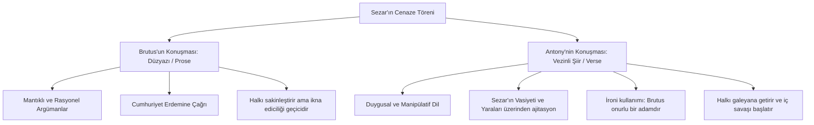

# Julius Caesar: Cumhuriyetçilik, Tiranlık ve Retoriğin Gücü

William Shakespeare'in 1599 yılında yazdığı *Julius Caesar*, Ozan'ın Roma tarihi oyunlarının ilkidir. Sezar'ın suikastı ve sonrasındaki iç savaşı konu alan eser; idealizm ile realizm, kişisel dostluk ile politik görev, cumhuriyetçilik ile tiranlık arasındaki çatışmaları işleyen politik bir başyapıttır.

---

## 1. Brutus'un Trajik İkilemi: Dostluk vs. Vatanseverlik

Oyunun asıl trajik kahramanı Julius Caesar değil, Marcus Brutus'tur. Brutus, erdemli, felsefi derinliği olan ve cumhuriyete yürekten bağlı bir Roma aristokratıdır.

- **İçsel Çatışma:** Brutus, Sezar'ı şahsen çok sever ve ona saygı duyar. Ancak Sezar'ın kral olup cumhuriyeti yıkmasından korkar. Cassius'un onu suikast planına ikna etmesi, Brutus'un cumhuriyetçi idealizmini tetiklemesiyle olur. Brutus, cinayeti kişisel nefretle değil, vatanseverlik göreviyle işler:
  > *"Sezar'ı sevmediğimden değil, Roma'yı daha çok sevdiğimden..."*  
  > — **Julius Caesar, Perde III, Sahne II, Satır 22-23**
- **Trajik Hata:** Brutus'un hatası, diğer suikastçıların (örneğin Cassius'un) politik kıskançlıklarını ve çıkarcılıklarını göremeyecek kadar saf ve idealist olmasıdır. Sezar'ın son sözü bu ihanetin acısını özetler:
  > *"Sen de mi, Brutus? Öyleyse yıkıl Sezar!"*  
  > — **Julius Caesar, Perde III, Sahne I, Satır 77**

---

## 2. Retoriğin Gücü: Brutus vs. Mark Antony

Oyunun dönüm noktası, Sezar'ın ölümünün ardından halka hitap edilen cenaze konuşmaları sahnesidir (Perde III, Sahne II). Bu sahne, hitabet sanatının (rhetoric) kitleleri nasıl yönlendirebildiğinin edebi bir dersidir.

- **Antony'nin İronik Başyapıtı:** Antony, konuşmasına Brutus ve suikastçılara saldırmadan, onların "onurlu adamlar" (honourable men) olduğunu söyleyerek başlar. Ancak konuşma ilerledikçe bu ifadeyi öyle bir tonlar ve kanıtlar sunar ki, kelimenin anlamını tamamen tersyüz eder:
  > *"Dostlar, Romalılar, yurttaşlar, dinleyin beni; / Ben Sezar'ı gömmeye geldim, övmeye değil. / (...) Brutus onun hırslı olduğunu söyledi; / Eğer öyleyse, bu ağır bir suçtu... / Ve Brutus onurlu bir adamdır..."*  
  > — **Julius Caesar, Perde III, Sahne II, Satır 78-104**

---

## 3. Güvenilmez Kitleler: Roma Halkı (Plebeians)

Shakespeare, oyunda sıradan Roma halkını (plebler) rüzgarda savrulan, kendi çıkarlarından başka bir şey düşünmeyen, manipülasyona son derece açık ve istikrarsız bir güruh olarak resmeder. 
Brutus konuşurken suikastçıları alkışlayıp cumhuriyeti överlerken, birkaç dakika sonra Antony konuştuğunda hemen fikir değiştirip suikastçıların evlerini yakmaya karar verirler. Bu durum, Shakespeare'in saf demokrasiye duyduğu kuşkuyu ve kitle psikolojisinin tehlikelerini ortaya koyar.

---

## 4. Kader ve Yıldızlar

Brutus, Cassius'a tarihi fırsatları değerlendirmek üzerine yaptığı konuşmada kader ve eylem ilişkisini şöyle açıklar:
> *"İnsan işlerinin gidişatında bir gelgit vardır; / Akıntı yükseldiğinde yakalanırsa, servete götürür; / Kaçırılırsa, hayatın tüm yolculuğu sığlıklarda ve sefalette kaybolur."*  
> — **Julius Caesar, Perde IV, Sahne III, Satır 218-221**

---

## 5. Kaynaklar ve Akademik Atıflar

- **Anson, John.** "Julius Caesar: The Politics of the Hardened Heart". *Shakespeare Studies*, vol. 2, 1966, pp. 11-33.
- **Kahn, Coppélia.** *Roman Shakespeare: Warriors, Wounds, and Women*. Routledge, 1997.
- **Mebane, John S.** "The Rhetoric of Idealism in Julius Caesar". *Studies in Philology*, vol. 91, no. 3, 1994, pp. 297-320.
