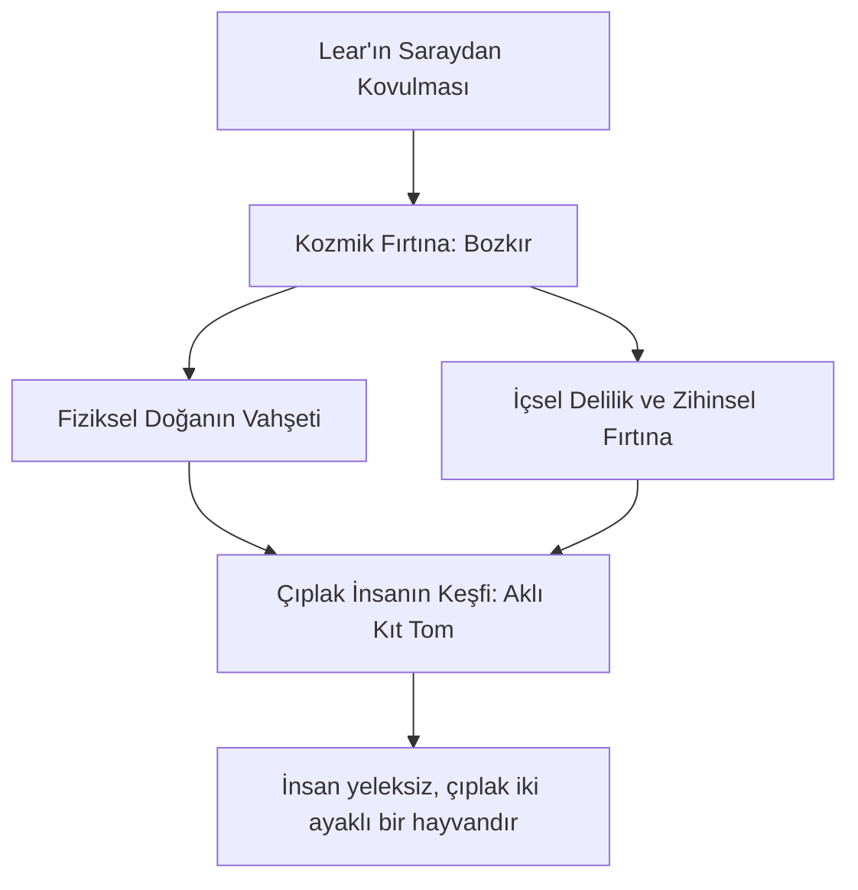

# Kral Lear: İktidardan Vazgeçiş, Körlük ve Nihai Aydınlanma

1605-1606 yıllarında yazılan *Kral Lear*, insanlık durumunun sınırlarını en acımasız biçimde sorgulayan, kozmik bir trajedi olarak kabul edilir. Yaşlanan bir kralın krallığını üç kızı arasında paylaştırma kararıyla başlayan oyun; aile bağlarının kopuşunu, devlet otoritesinin çöküşünü ve doğanın vahşeti karşısında çıplak kalan insanın varoluşsal çaresizliğini resmeder.

---

## 1. Otorite Kaybı ve Metaforik Körlük

Kral Lear'ın trajedisi, iktidarın getirdiği kibir ve dalkavukluğa olan bağımlılığı nedeniyle gerçek sevgiyi sahte sevgiden ayırt edememesidir.

- **Körlük ve İtiraf:** Lear, en küçük kızı Cordelia'nın dalkavukluk yapmayı reddeden dürüst tavrını (*"Hiçbir şey, efendim"* - *Nothing, my Lord*) anlayamaz ve onu evlatlıktan reddeder. Aynı şekilde Gloucester Kontu da sadık oğlu Edgar'ı gayrimeşru oğlu Edmund'ın yalanlarına inanarak sürgün eder. Her iki yaşlı baba da "metaforik olarak kördür".
- **Gloucester'ın Gözleri:** Gloucester, gözleri Cornwall Dükü tarafından vahşice oyulduktan sonra gerçeği görebilir:
  > *"Gözlerim varken yolumu göremezdim zaten; / Tökezleriz çoğu kez çok şeyimiz olduğunda..."*  
  > — **Kral Lear, Perde IV, Sahne I, Satır 18-19**

---

## 2. Doğanın İki Yüzü: Kozmik Fırtına ve İnsanın Çıplaklığı

Oyunun merkezindeki fırtına sahnesi (Perde III), hem doğanın kozmik gücünü hem de Lear'ın iç dünyasındaki psikolojik fırtınayı temsil eder.

- **Kozmik İsyan:** Lear bozkırın ortasında gökyüzüne haykırır:
  > *"Es rüzgarlar, yanaklarınız çatlayana kadar esin! Fırla fırtına! / (...) Ben günahı olanlardan çok, günah yüklenmiş bir adamım!"*  
  > — **Kral Lear, Perde III, Sahne II, Satır 1-21**
- **Çıplak İnsan:** Lear, aklını yitirmeye başladığı bu bozkırda Edgar'ı "çıplak bir dilenci" (Aklı Kıt Tom) kılığında gördüğünde, insanın toplumsal unvanlarından sıyrıldığında ne kadar aciz olduğunu anlar: *"İnsan bundan başka bir şey değil mi? (...) Sen yeleksiz, çatal bacaklı zavallı bir hayvansın benim gözümde."*

---

## 3. Soytarı (The Fool) ve Delinin Bilgeliği

Shakespeare tiyatrosunun en özgün karakterlerinden biri olan Lear'ın Soytarı'sı, kralın vicdanı ve rasyonel aklı rolündedir.

- **Tersyüz Edilen Düzen:** Soytarı, krala tacını kızlarına vererek aslında kendi tahtını yıktığını ve kendisini aptal durumuna düşürdüğünü söyler. Onun şakaları ve şarkıları, Lear'ın yüzleşmek istemediği acı gerçeklerdir.
- **Deli ve Bilge:** Delilik ile bilgelik oyunda yer değiştirmiştir. Kral delirdiğinde gerçeği görmeye başlar, Soytarı ise delice konuşurken saraydaki herkesten daha bilgedir.

---

## 4. Nihilizm ve Adaletsiz Evren

*Kral Lear*, diğer Shakespeare trajedilerinden farklı olarak, ilahi adaletin tamamen yok olduğu bir evren sunar. Cordelia'nın oyunun sonunda masum olmasına rağmen asılarak öldürülmesi, seyirciyi mutlak bir sessizliğe ve kedere boğar. Lear, kızının cesedini kucağında taşırken haykırır:

> *"Neden bir köpek, bir at, bir sıçan yaşar da / Senin nefes alacak tek bir saniyen bile kalmaz? / Gittin artık, bir daha dönmeyeceksin asla, / Asla, asla, asla, asla, asla..."*  
> — **Kral Lear, Perde V, Sahne III, Satır 306-309**

---

## 5. Kaynaklar ve Akademik Atıflar

- **Greenblatt, Stephen.** *Shakespearean Negotiations: The Circulation of Social Energy in Renaissance England*. University of California Press, 1988.
- **Mack, Maynard.** *King Lear in Our Time*. Indiana University Press, 1965.
- **Kott, Jan.** "King Lear or Endgame". *Shakespeare Our Contemporary*. Anchor Books, 1966.
