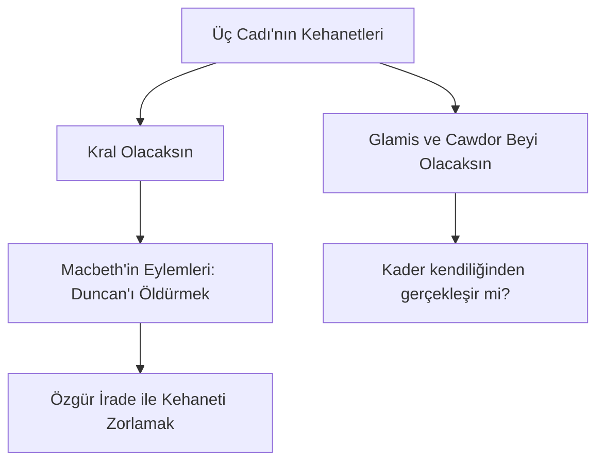

# Macbeth: Hırs, Suçluluk ve İktidarın Karanlığı

William Shakespeare'in 1606 yılında yazdığı *Macbeth*, onun en kısa ama en dinamik ve karanlık trajedisidir. İskoçya kralı Duncan'ı öldürerek tahtı ele geçiren general Macbeth'in yükselişi ve kaçınılmaz düşüşünü konu alan oyun; hırsın, vicdan azabının ve mutlak gücün insan ruhunu nasıl yozlaştırdığının evrensel bir incelemesidir.

---

## 1. Hamartia Olarak "Boyun Eğmez Hırs" (Vaulting Ambition)

Macbeth'in trajik kusuru (*hamartia*), kehanetlerle tetiklenen ve eşi Lady Macbeth tarafından kışkırtılan sınırsız hırsıdır. Macbeth, başlangıçta cesur ve sadık bir askerdir; ancak kral olma arzusu, onun ahlaki değerlerini gölgeler.

- **Lady Macbeth'in Manipülasyonu:** Lady Macbeth, kocasının doğasını *"iyilik sütüyle dolu"* bulduğu için onu korkaklıkla suçlar ve erkeksi bir gaddarlığa çağırır:
  > *"Gelin, ey kötülük ruhları, / Kadınlığımdan sıyırın beni şimdi, / Baştan ayağa en amansız gaddarlıkla doldurun içimi!"*  
  > — **Macbeth, Perde I, Sahne V, Satır 38-41**
- **Sonsuz Döngü:** Duncan'ı öldürdükten sonra Macbeth, tahtını korumak için Banquo ve Macduff'ın ailesi gibi masumları da katletmek zorunda kalır. Güç elde etmek için girilen cinayet sarmalı onu yalnızlaştırır ve paranoyaklaştırır.

---

## 2. Kehanetler, Kader ve Özgür İrade

Oyundaki Üç Cadı (The Weird Sisters), Macbeth'in zihnindeki karanlık arzuları yansıtan katalizörlerdir.

- **Kaderin Muğlaklığı:** Cadılar Macbeth'e kral olacağını söyler ama bunu *nasıl* yapacağını belirtmezler. Macbeth'in trajedisi, kehaneti kendi elleriyle (cinayet işleyerek) gerçekleştirmeye çalışmasıdır. 
- **Çelişkiler Dünyası:** Cadıların açılış sahnesindeki ünlü dizesi, oyundaki ahlaki karmaşayı özetler:
  > *"Güzel çirkindir, çirkin de güzel..."*  
  > — **Macbeth, Perde I, Sahne I, Satır 10**

---

## 3. Vicdan Azabı ve Psikolojik Yıkım

Cinayet sonrasında hem Macbeth hem de Lady Macbeth korkunç bir suçluluk duygusuyla baş başa kalır.

- **Kandaki Eller:** Macbeth, ellerindeki kanın tüm okyanusları kırmızıya boyayacağını düşünür (Perde II, Sahne II). Lady Macbeth ise başlangıçta *"Bir parça su temizler bizi bu işten"* dese de oyunun sonunda uyurgezerlik krizine girerek ellerindeki hayali kan lekelerini yıkamaya çalışır:
  > *"Çık, lanet leke! Çık diyorum sana! (...) Arabistan'ın tüm kokuları temizleyemez bu küçük eli."*  
  > — **Macbeth, Perde V, Sahne I, Satır 30-48**
- **Uykunun Katli:** Macbeth'in Duncan'ı öldürdüğü an duyduğu ses (*"Macbeth uykuyu katletti, artık uyumayacak!"*), masumiyetin ve iç huzurun sonsuza dek kaybedildiğinin ilanıdır.

---

## 4. Nihilizm ve Hayatın Anlamsızlığı

Eşinin intihar haberini alan ve orduların sarayına dayandığını gören Macbeth, varoluşun mutlak anlamsızlığını ilan ettiği edebiyat tarihinin en ünlü nihilist tiradını söyler:

> *"Sön, sön kısa mum! / Hayat denilen şey, yürüyen bir gölgedir sadece; / Sahneye çıkıp saati gelince çırpınan, kasılan, / Sonra da bir daha adı duyulmayan zavallı bir oyuncu. / Bir aptalın anlattığı bir masaldır hayat; / Şamata dolu, öfke dolu, ama hiçbir anlamı olmayan..."*  
> — **Macbeth, Perde V, Sahne V, Satır 22-27**

---

## 5. Kaynaklar ve Akademik Atıflar

- **Bradley, A. C.** *Shakespearean Tragedy: Lectures on Hamlet, Othello, King Lear, Macbeth*. Palgrave Macmillan, 1904.
- **Bloom, Harold.** *Shakespeare: The Invention of the Human*. Riverhead Books, 1998.
- **Knight, G. Wilson.** *The Wheel of Fire: Interpretations of Shakespearian Tragedy*. Routledge, 1930.
