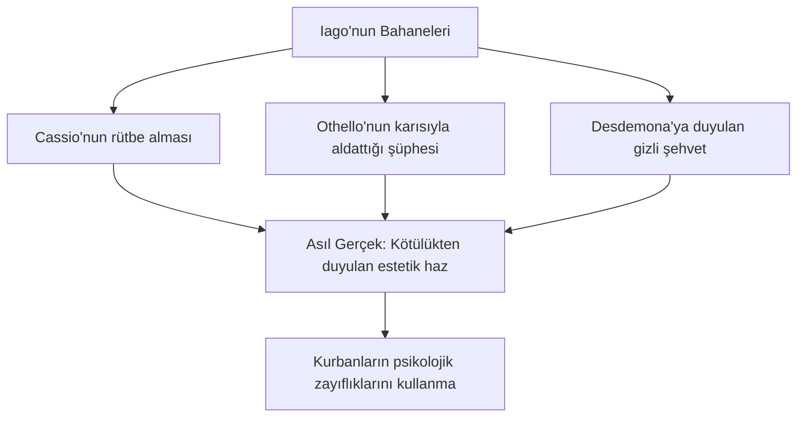

# Othello: Kıskançlık, Yabancılaşma ve Psikolojik Manipülasyon

Yaklaşık 1603-1604 yıllarında yazılan *Othello, Venedik Mağribisi*, Shakespeare'in en yoğun, en dar kapsamlı ve psikolojik gerilimi en yüksek olan trajedisidir. Diğer büyük trajedilerin aksine, kozmik olaylar veya krallıkların çöküşü yerine, tamamen kişisel ilişkiler, evlilik, güven ve ihanet temaları üzerine odaklanır.

---

## 1. Yeşil Gözlü Canavar: Kıskançlık ve Yıkım

Oyunun temel çatışması, Othello'nun eşi Desdemona'ya karşı duyduğu patolojik kıskançlıktır. Kıskançlık, oyunda mantığı yok eden, insanı hayvani dürtülere indirgeyen parazitik bir güç olarak betimlenir.

- **Iago'nun Uyarısı:** Iago, Othello'nun zihnine şüphe tohumlarını ekerken kıskançlığı meşhur bir metaforla tarif eder:
  > *"Kıskançlıktan sakının, efendim! / O, kurbanının etiyle beslenen ve onunla alay eden / Yeşil gözlü bir canavardır."*  
  > — **Othello, Perde III, Sahne III, Satır 165-167**
- **Sembol Olarak Mendil:** Desdemona'nın çilek motifli ipek mendili, masumiyetin ve sadakatin fiziksel bir sembolüyken, Iago'nun onu çalmasıyla ihanetin nihai kanıtına (proof) dönüşür. Küçük nesnelerin trajik sonuçlar doğurma gücünün en büyük örneğidir.

---

## 2. Iago: "Motivasyonsuz Kötülük" ve Manipülasyon

Edebi eleştirmen Samuel Taylor Coleridge, Iago'nun kötülüğünü **"motivasyonsuz kötülük"** (motiveless malignity) olarak tanımlamıştır.

- **Manipülasyon Sanatı:** Iago, kurbanlarının kendi erdemlerini onlara karşı bir silah olarak kullanır. Desdemona'nın yardımseverliğini Cassio ile flört ediyormuş gibi gösterir; Othello'nun açık sözlü, dürüst ve güvenir yapısını ise onu kandırmak için kullanır: *"O dürüst bir doğaya sahip, öyle ki her göründüğünü öyle sanır."*
- **Sessiz Kötülük:** Oyunun sonunda planları ortaya çıktığında konuşmayı reddeder: *"Ne gördüyseniz gördünüz; bundan sonra tek bir kelime bile etmeyeceğim."* Bu durum onun kötülüğünün dilde açıklanamayacak karanlığını temsil eder.

---

## 3. Irk, Öteki Olmak ve Toplumsal Yabancılaşma

Othello, Venedik devletine hizmet eden başarılı bir general olsa da bir Hristiyan Avrupalı değil, Mağribidir (Moor - Kuzey Afrikalı/Siyahi).

- **İçselleştirilmiş Değersizlik:** Brabantio (Desdemona'nın babası), kızının Othello'ya ancak büyü yapılmışsa aşık olabileceğini savunur. Iago ise sürekli olarak hayvani ırkçı metaforlar kullanır (*"yaşlı bir kara koç"*).
- **Yabancılık:** Othello ne kadar asil olursa olsun, Venedik aristokrasisi için her zaman bir "öteki"dir. Iago, Othello'nun bu kültürel yabancılığını ve güvensizliğini tetikler; Desdemona'nın eninde sonunda kendi ırkından ve sınıfından birine (Cassio) yöneleceğini iddia ederek Othello'yu zihnen çökertir.

---

## 4. Othello'nun Trajik Çöküşü ve Ölümü

Othello, oyunun başında hitabet yeteneği güçlü, soğukkanlı ve asil bir liderdir. Ancak Iago'nun manipülasyonları sonrasında konuşması bozulur, nöbetler geçirir ve hayvani haykırışlara başlar (*"Keçiler ve maymunlar!"*).

Desdemona'yı yatakta boğarak öldürdükten sonra gerçeği öğrendiğinde yaşadığı acı büyüktür. İntihar etmeden önceki son konuşmasında, kendisinin nasıl hatırlanması gerektiğini söyler:

> *"Benden bahsettiğinizde, bilgece değil ama çok fazla sevmiş biri deyin; / Kolayca kıskanmayan, ama bir kez kışkırtıldı mı / Çılgınlar gibi sürüklenen biri deyin..."*  
> — **Othello, Perde V, Sahne II, Satır 344-347**

---

## 5. Kaynaklar ve Akademik Atıflar

- **Coleridge, Samuel Taylor.** *Lectures and Notes on Shakespeare and Other English Poets*. George Bell and Sons, 1904.
- **Loomba, Ania.** *Gender, Race, Renaissance Drama*. Manchester University Press, 1989.
- **Nuttall, A. D.** *Shakespeare the Thinker*. Yale University Press, 2007.
