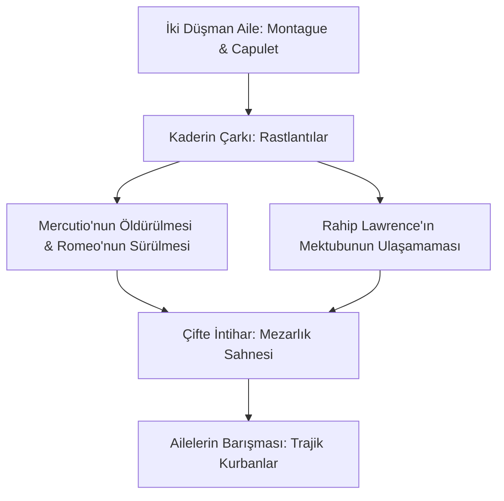

# Romeo ve Juliet: Bireysel Tutku, Toplumsal Yasak ve Kaderin Çarkı

William Shakespeare'in yaklaşık 1595-1596 yıllarında yazdığı *Romeo ve Juliet*, dünya edebiyatının en ünlü aşk trajedisidir. Eser, Verona'nın iki düşman ailesi olan Montague ve Capulet hanedanlarının çocukları arasındaki imkansız aşkı konu alırken, bireysel özgürlük, kader, toplumsal baskı ve ölüm temalarını derinlemesine işler.

---

## 1. Saray Aşkından Ölümcül Tutkuya Geçiş

Oyunun başında Romeo, Rosaline adında bir kadına platonik, melankolik ve yapay bir "saray aşkı" (courtly love) duymaktadır. Ancak Juliet'i gördüğü an bu yapay duygu yok olur ve yerini her şeyi göze alan, dönüştürücü ve ölümcül bir tutkuya bırakır.

- **Balkon Sahnesi ve İsmin Önemsizliği:** Juliet, toplumsal kimliklerin ve soyadlarının aşkın önündeki yapay engeller olduğunu meşhur tiradında dile getirir:
  > *"Gülün adı başka olsaydı, kokmaz mıydı yine aynı tatlılıkla? / Romeo, at o adını; senin parçan olmayan o ada karşılık, / Al benim bütün varlığımı!"*  
  > — **Romeo ve Juliet, Perde II, Sahne II, Satır 43-48**
- **Romeo'nun Yanıtı:** Romeo da toplumsal aidiyeti reddeder:
  > *"Adımı ben de sevmiyorum artık, / Çünkü o ad bir düşmandır sana."*  
  > — **Romeo ve Juliet, Perde II, Sahne II, Satır 54-56**

---

## 2. Kader ve "Yıldızı Barışmamış Aşıklar" (Star-Cross'd Lovers)

Oyunun en başında Koro (Chorus), aşıkların kaderinin trajik sonunu seyirciye ilan eder. Bu durum, antik Yunan trajedilerindeki kaçınılmaz kader (*fate*) kavramının oyuna hakim olduğunu gösterir.

- **Kozmik Uyumsuzluk:** Aşıklar *"yıldızı barışmamış"* (star-cross'd) olarak tanımlanır. Gökyüzündeki yıldızlar ve gezegenler, aşıkların aleyhine hizalanmıştır. Romeo, Juliet'in ölüm haberini aldığında (gerçekte uyutucu iksir içmiştir) gökyüzüne meydan okur:
  > *"Öyleyse meydan okuyorum size ey yıldızlar!"*  
  > — **Romeo ve Juliet, Perde V, Sahne I, Satır 24**

---

## 3. Işık ve Karanlık İmgesi (Light/Dark Imagery)

Shakespeare, oyundaki duygusal yükseliş ve alçalışları anlatmak için kontrast oluşturan ışık ve karanlık imgelerini yoğun bir biçimde kullanır.

- **Gece ve Gündüzün Tersyüz Edilmesi:** Geleneksel olarak ışık güvenlik, karanlık ise tehlike anlamına gelirken, bu oyunda roller değişir. Aşıklar için gün ışığı tehlikedir (çünkü düşman aileler sokakta karşılaşabilir ve Romeo sürgün edilmiştir), gece ise kavuşabildikleri, güvende oldukları sığınaktır.
- **Juliet'in Parlaklığı:** Romeo, Juliet'i hep etrafına ışık saçan bir varlık olarak betimler:
  > *"Yaralarla alay eder hiç yara almamış olan... / Ama dur, hangi ışık süzülüyor şu pencereden? / Bak, orası doğudur, Juliet de güneştir orada!"*  
  > — **Romeo ve Juliet, Perde II, Sahne II, Satır 1-3**

---

## 4. Birey ve Toplum Çatışması

Romeo ve Juliet, Rönesans'ın bireyci ahlakını temsil eder. Onlar, ailelerinin yüzyıllık kan davasını, dini kuralları ve Verona Dükü'nün yasalarını hiçe sayarak kendi ahlaki dünyalarını kurarlar. Ancak bu bireysel isyan, feodal toplumsal yapının sert duvarına çarpar. Trajik son, ancak gençlerin ölümüyle ailelerin vicdana gelmesi ve barışmasıyla çözülür; bu da toplumsal barışın bedelinin masumiyetin kurban edilmesi olduğunu gösterir.

---

## 5. Kaynaklar ve Akademik Atıflar

- **Kahn, Coppélia.** "Coming of Age in Verona". *Modern Language Studies*, vol. 8, no. 1, 1977, pp. 5-22.
- **Kristeva, Julia.** *Tales of Love*. Columbia University Press, 1987 (Romeo ve Juliet üzerine psikanalitik okuma).
- **Porter, Joseph A.** *Shakespeare's Mercutio: His History and Drama*. University of North Carolina Press, 1988.
