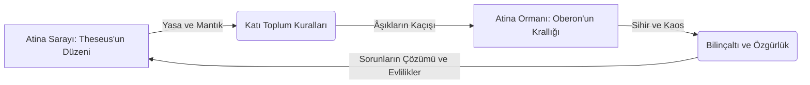

# Bir Yaz Gecesi Rüyası: Yeşil Dünya, Kaos ve Aşkın Sihri

1595-1596 yıllarında yazılan *Bir Yaz Gecesi Rüyası*, William Shakespeare'in en popüler ve sahnelenmesi en keyifli erken dönem komedilerinden biridir. Eser, mitolojiyi, İngiliz folklöründeki peri masallarını ve tiyatro üzerine yapılan meta-anlatıları harmanlayarak gerçek ile rüya, mantık ile aşk arasındaki ince çizgiyi sorgular.

---

## 1. Atina Sarayı ile Orman Karşıtlığı: Mantık vs. Kaos

Oyunun mekansal yapısı, iki karşıt kutup üzerine kurulmuştur:

- **Atina Sarayı:** Dük Theseus ve Hippolyta tarafından temsil edilen Atina sarayı; düzeni, yasayı, mantığı ve ataerkil otoriteyi temsil eder. Burada yasa katıdır; Hermia ya babasının istediği adamla evlenmeli ya ölüme mahkum edilmeli ya da rahibe olmalıdır.
- **Atina Ormanı:** Hermia, Lysander, Helena ve Demetrius'un kaçtığı orman ise sihir, gece, gizem, kaos ve arzu alanıdır. Burada periler kralı Oberon ve kraliçe Titania hüküm sürer. Orman, toplumsal kuralların askıya alındığı ve bastırılmış arzuların serbest kaldığı bir "rüya" uzamıdır.

---

## 2. Northrop Frye ve "Yeşil Dünya" (Green World) Teorisi

Kanadalı edebi teorisyen Northrop Frye, Shakespeare komedilerini analiz ederken **"Yeşil Dünya"** (Green World) kavramını ortaya atmıştır.

- **Yeşil Dünya Döngüsü:** Frye'a göre bu komedilerde karakterler, katı yasaları olan normal dünyadan (şehir/saray) kaçıp doğanın/ormanının egemen olduğu "yeşil dünyaya" sığınırlar. Yeşil dünyada düzen tamamen altüst olur, kimlikler karışır, cinsel roller tersyüz edilir. Ancak bu kaos süreci arındırıcıdır; aşıklar burada kendi gerçeklerini keşfederler ve oyunu çözüme ulaştırıp daha sağlıklı, yenilenmiş bir toplumsal düzen kurmak üzere normal dünyaya dönerler.

---

## 3. Sihirli İksir, Aşk ve Dönüşüm

Ormandaki kaosun ana yöneticisi, yaramaz peri **Puck** (Robin Goodfellow) ve Oberon'un kullandığı sihirli çiçek iksiridir (Love-in-idleness).

- **Kör Aşk:** Göz kapaklarına damlatılan bu iksir, kişinin uyandığında gördüğü ilk canlıya sırılsıklam aşık olmasına yol açar. Bu durum, aşkın rasyonel bir seçim değil, tamamen gözü kör bir yanılsama ve gelgeç bir heves olduğunu hicveder.
- **Edebi Hiciv:** Lysander ve Demetrius'un iksir etkisiyle Helena'ya yönelmesi ve kraliçe Titania'nın eşek kafalı Bottom'a aşık olması, aşkın absürtlüğünü ve mantıksızlığını sergiler.

---

## 4. Düşler, Sanat ve Şairin Yaratıcılığı

Dük Theseus, aşıkların ormanda yaşadıkları fantastik olayları şüpheyle karşılar ve deli, aşık ve şairi aynı düzlemde ele alan ünlü konuşmasını yapar:

> *"Deli, aşık ve şair, / Hayal gücünden ibarettir hepsi. / Biri, geniş cehennemin alamayacağı kadar çok şeytan görür; / Ki bu çılgın aşığın ta kendisidir. / Şairin gözü, tatlı bir çılgınlıkla dönüp dururken, / Gökyüzünden yeryüzüne, yeryüzünden gökyüzüne bakar; / Ve hayal gücü bilinmeyen şeylerin biçimini doğururken, / Şairin kalemi onları bir şekle sokar, / Ve hiçliğe bir isim, bir yurt verir."*  
> — **Bir Yaz Gecesi Rüyası, Perde V, Sahne I, Satır 7-17**

Oyunun sonunda Puck, seyircilere hitaben bir epilog söyler; yaşanan her şeyin aslında bir tiyatro oyunu, yani kolektif bir rüya olduğunu hatırlatır: *"Biz gölgeler eğer gücendirdiysek sizi, / Sadece şöyle düşünün ve düzeltin her şeyi: / Siz burada uyuklarken, / Bu düşler belirdi sadece..."*

---

## 5. Kaynaklar ve Akademik Atıflar

- **Frye, Northrop.** *Anatomy of Criticism*. Princeton University Press, 1957.
- **Barber, C. L.** *Shakespeare's Festive Comedy: A Study of Dramatic Form and its Relation to Social Custom*. Princeton University Press, 1959.
- **Garber, Marjorie.** *Dream in Shakespeare: From Metaphor to Metamorphosis*. Yale University Press, 1974.
