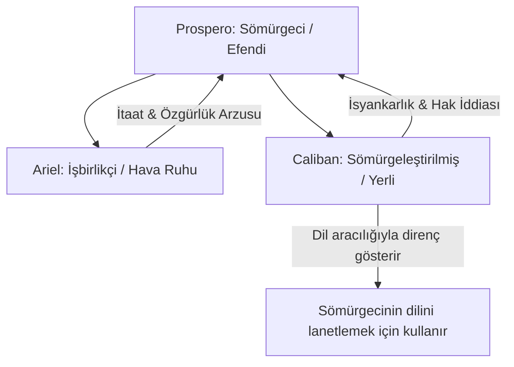

# Fırtına: Sömürgecilik, Sihir ve Ozanın Vedası

William Shakespeare'in tek başına yazdığı son oyun olarak kabul edilen *Fırtına* (1610-1611), hem bir romans hem de bir trajikomedi (romance/tragicomedy) olarak sınıflandırılır. Milano Dükalığı'ndan kardeşi ve Napoli Kralı tarafından sürgün edilen, sihirli güçlere sahip Prospero'nun, kızı Miranda ile sığındığı adadaki intikam ve bağışlama mücadelesini anlatır.

---

## 1. Post-Kolonyal Okuma: Prospero, Caliban ve Ariel

20. yüzyılın ortalarından itibaren *Fırtına*, sömürgecilik ve emperyalizm bağlamında yeniden okunmuş ve edebiyat eleştirisinin merkezine oturmuştur.

- **Prospero ve Caliban:** Prospero adaya geldiğinde, adanın yerlisi ve eski sahibi Sycorax'ın oğlu Caliban'ı eğitir, ona dilini öğretir. Ancak daha sonra onu köleleştirir ve ağır işlerde çalıştırır. Caliban, toprağı elinden alınmış sömürge halklarının sembolüdür:
  > *"Bana dil öğrettiniz; bundan kârım ne oldu derseniz, / Nasıl lanet edileceğini öğrendim sayenizde."*  
  > — **Fırtına, Perde I, Sahne II, Satır 363-364**
- **Ariel:** Ariel, uysal ve efendisine hizmet eden, özgürlüğünü itaatle kazanmaya çalışan "işbirlikçi" yerli tiplemesidir. Caliban ise isyankar ve fiziksel şiddetle özgürlüğünü geri almaya çalışan direnişçi yerlidir.

---

## 2. Dil, Güç ve Eğitim

Oyunda dil, sömürgeci iktidarın en önemli aracıdır. Prospero ve Miranda, Caliban'a kendi dillerini öğreterek onu "medenileştirdiklerini" iddia ederler. Ancak bu eğitim, aynı zamanda Caliban'ın kendi kültürel kimliğinin yok edilmesidir. Caliban'ın Prospero'ya kendi diliyle isyan etmesi, sömürgecilik karşıtı edebiyatın (özellikle Aimé Césaire ve Frantz Fanon) en önemli referans noktalarından biri olmuştur.

---

## 3. Prospero'nun Sihri ve Tiyatro Alegorisi

Prospero, olayları sihirli asası, kitapları ve peleriniyle yöneten bir "yönetmen" gibidir. Bu yönüyle Prospero karakteri, oyun yazarı olarak bizzat William Shakespeare'in kendisiyle özdeşleştirilir.

- **Sanatın Geçiciliği:** Aşıklar için düzenlenen fantastik mask oyununun (masque) ardından Prospero, hem sanatının hem de insan hayatının geçiciliğini ilan eder:
  > *"Bizler rüyaların yapıldığı maddeden yapılmışız, / Ve küçücük hayatımız bir uykuyla çevrelenmiştir."*  
  > — **Fırtına, Perde IV, Sahne I, Satır 156-158**
- **Sihri Bırakmak:** Oyunun sonunda Prospero'nun asasını kırıp sihirli kitabını denizin derinliklerine gömeceğini söylemesi (Perde V, Sahne I), Shakespeare'in Londra tiyatro sahnelerine ve yazarlığa vedası olarak yorumlanır.

---

## 4. Epilog: Seyirciden Özgürlük Dilemek

Oyunun epilogunda Prospero (ve dolayısıyla Shakespeare), sihirli güçlerini kaybetmiş bir şekilde sahnede yalnız kalır ve seyirciden alkışlarıyla kendisini özgür bırakmasını diler:

> *"Şimdi sihirlerim bozuldu hepsi, / Kaldı sadece kendi gücüm, / O da en zayıfı... / (...) Alkışlarınızla çözün bağlarımı, / Bağışlayın beni, bırakın gideyim."*  
> — **Fırtına, Epilog, Satır 1-20**

---

## 5. Kaynaklar ve Akademik Atıflar

- **Vaughan, Alden T. and Virginia Mason Vaughan.** *Shakespeare's Caliban: A Cultural History*. Cambridge University Press, 1991.
- **Césaire, Aimé.** *Une Tempête*. Seuil, 1969 (Fırtına'nın post-kolonyal adaptasyonu).
- **Fanon, Frantz.** *Les Damnés de la Terre* (Yeryüzünün Lanetlileri). Maspero, 1961.
