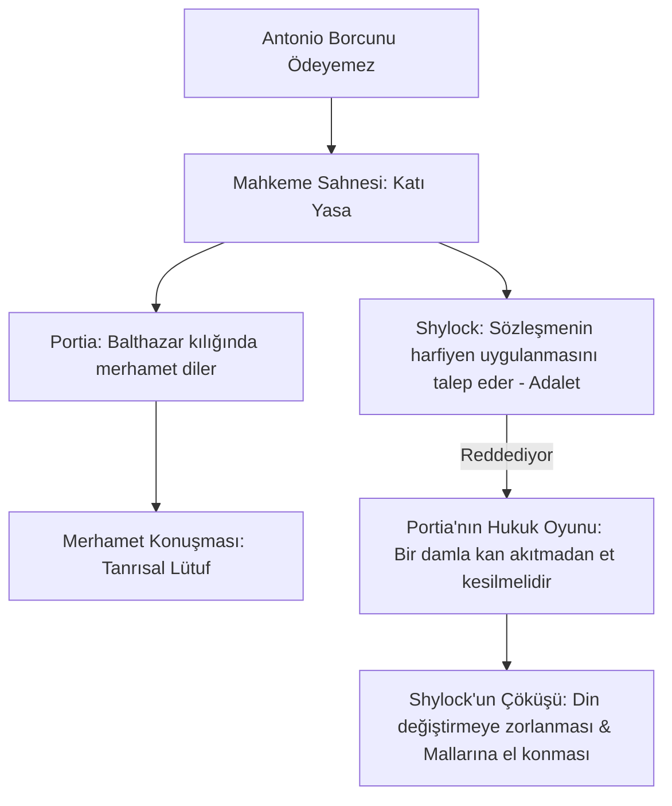

# Venedik Taciri: Adalet, Merhamet ve Shylock'un İnsanlığı

William Shakespeare'in yaklaşık 1596-1597 yıllarında yazdığı *Venedik Taciri*, geleneksel olarak komedi (veya problem oyunu - problem play) kategorisinde yer alsa da, barındırdığı trajik unsurlar ve ahlaki karmaşalar nedeniyle edebiyat tarihinin en çok tartışılan eserlerinden biridir. Eser; Hristiyan tüccar Antonio ile Yahudi tefeci Shylock arasındaki borç sözleşmesi üzerinden adalet, merhamet, yabancı düşmanlığı ve intikam temalarını işler.

---

## 1. Shylock: Canavar mı, Kurban mı?

Elizabeth dönemi İngiltere'sinde Yahudiler ülkeden sürülmüştü (1290 Edict of Expulsion) ve toplumda yoğun bir antisemitizm hakimdi. Shakespeare, başlangıçta Shylock'u karikatürize bir kötü adam (villain) olarak tasarlamış gibi görünse de, ona öyle bir insani derinlik kazandırmıştır ki karakter, kurban edilmiş trajik bir figüre dönüşür.

- **İnsanlık Çığlığı:** Shylock'un Hristiyanların ikiyüzlülüğünü ve maruz kaldığı ırkçılığı haykırdığı ünlü tiradı, dünya edebiyatının en güçlü eşitlik savunmalarından biridir:
  > *"Bir Yahudinin gözleri yok mudur? Bir Yahudinin elleri, organları, boyutları, duyuları, sevgileri, tutkuları yok mudur? (...) Bizi etinizle beslerseniz doymaz mıyız? Bizi gıdıklarsanız gülmez miyiz? Bizi zehirlerseniz ölmez miyiz? Ve bize yanlış yaparsanız, intikam almaz mıyız?"*  
  > — **Venedik Taciri, Perde III, Sahne I, Satır 58-68**
- **Et Sözleşmesi:** Antonio'nun borcunu ödeyememesi durumunda bedeninden "bir pound et" (yarım kilo et) kesilmesini talep etmesi, Shylock'un maruz kaldığı aşağılanmalara (yüzüne tükürülmesi, köpek denmesi) karşı duyduğu intikam arzusunun vahşi bir simgesidir.

---

## 2. Adalet (Yasa) ile Merhamet (Lütuf) Çatışması

Oyunun dönüm noktası olan mahkeme sahnesi (Perde IV, Sahne I), katı hukuksal harfiyen adalet (letter of the law) ile Hristiyan lütuf ve merhamet (mercy) kavramlarının çatışmasıdır.

- **Portia'nın Merhamet Tiradı:** Portia (hukuk doktoru Balthazar kılığında), merhametin zorlamayla olmayacağını, onun Tanrısal bir erdem olduğunu söyler:
  > *"Merhamet zorlamayla olmaz; / Gökten süzülen o tatlı yağmur gibi dökülür altındaki toprağa. / İki kat kutsaldır o: / Hem vereni kutsar, hem alanı..."*  
  > — **Venedik Taciri, Perde IV, Sahne I, Satır 184-187**
- **Hukuki Tuzak:** Shylock merhamet etmeyi reddettiğinde, Portia yasayı onun aleyhine çevirir: Sözleşmede "et" yazmaktadır ama "kan" yazmamaktadır. Dolayısıyla tek bir damla kan akıtmadan tam olarak bir pound et kesmelidir; aksi takdirde bir Venedik vatandaşının canına kastetmekten tüm mal varlığını kaybedecektir.

---

## 3. Üç Sandık Simgeciliği (Caskets)

Portia ile evlenmek isteyen talipler, üç sandıktan (altın, gümüş, kurşun) birini seçmek zorundadır.

- **Altın Sandık:** *"Beni seçen, birçok insanın arzuladığı şeyi bulur."* (Kibir ve dış görünüşe aldanmayı simgeler).
- **Gümüş Sandık:** *"Beni seçen, hak ettiği kadarını alır."* (Hak etme yanılsamasını simgeler).
- **Kurşun Sandık:** *"Beni seçen, sahip olduğu her şeyi tehlikeye atmalıdır."* (Gerçek sevginin fedakarlık gerektirdiği gerçeğini simgeler. Doğru sandık budur).
- Bu allegorik yapı, oyundaki paranın sahte parlaklığına karşı insanın içsel değerlerinin üstünlüğünü vurgular.

---

## 4. İkiyüzlü Çözüm ve Hristiyan Adaleti

Oyunun sonunda Shylock'un din değiştirmeye zorlanması (Hristiyan yapılması) ve mallarının yarısının Antonio'ya, yarısının devlete verilmesi, dönemin seyircisi için mutlu son (komedi) iken, modern seyirci için korkunç bir asimilasyon ve adalet trajedisidir. Bu durum, oyunun adalet ve merhamet söylemindeki derin ahlaki tutarsızlığı ve ikiyüzlülüğü gözler önüne serer.

---

## 5. Kaynaklar ve Akademik Atıflar

- **Adelman, Janet.** *Blood Relations: Christian and Jew in The Merchant of Venice*. University of Chicago Press, 2008.
- **Gross, John.** *Shylock: A Legend and Its Legacy*. Touchstone, 1994.
- **Shapiro, James.** *Shakespeare and the Jews*. Columbia University Press, 1996.
