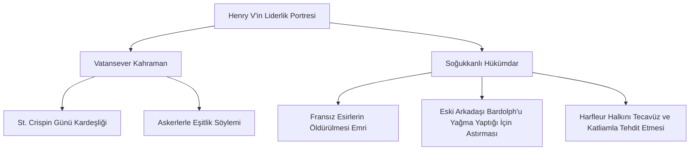

# Henry V: Vatanseverlik Miti ve Savaşın Etik Açmazları

William Shakespeare'in 1599 yılında yazdığı *Henry V*, Ozan'ın tarih oyunları dizisinin zirvesidir. İngiltere Kralı V. Henry'nin Fransa'yı istila edişini ve sayıca az olmasına rağmen Agincourt Savaşı'nda kazandığı zaferi konu alan oyun; hem İngiliz ulusal kimliğini kutsayan bir vatanseverlik destanı hem de savaşın vahşetini sorgulayan ikircikli bir metin olarak incelenmektedir.

---

## 1. Retorik Güç ve Liderlik Dehası

Henry V, gençlik yıllarındaki haylazlıklarından (Falstaff ile geçirdiği hovarda günlerden) sıyrılarak ideal bir hükümdar ve askeri deha portresi çizer. Onun en büyük silahı hitabet (rhetoric) yeteneğidir.

- **Harfleur Konuşması:** Kuşatma altındaki Harfleur kentinin kapısında askerlerini cesaretlendirirken onları ulusal kimlik bağıyla birleştirir:
  > *"Bir kez daha surların yarığına doğru, sevgili dostlar, bir kez daha! / Ya doldurun o duvarı İngiliz ölülerimizle..."*  
  > — **Henry V, Perde III, Sahne I, Satır 1-2**
- **St. Crispin Günü Konuşması:** Agincourt Savaşı öncesinde, sayıca çok üstün olan Fransız ordusuna karşı askerlerinin korkusunu asil bir kardeşlik bağına dönüştürür:
  > *"Biz azınlık, biz mutlu azınlık, biz kardeşler birliği! / Bugün benimle birlikte kanını döken kim varsa, / Kardeşim olacaktır benim..."*  
  > — **Henry V, Perde IV, Sahne III, Satır 60-62**

---

## 2. Savaşın Karanlık Yüzü ve Ahlaki İkilemler

Oyun, ilk bakışta kahramanlık destanı gibi görünse de alt metinlerde savaşın vahşetini ve kralın ahlaki açıdan sorgulanabilir kararlarını gözler önüne serer.

- **Savaş Hukukunun İhlali:** Henry, savaşın gidişatı tehlikeye girdiğinde tüm Fransız esirlerin boğazlanmasını emreder (Perde IV, Sahne VI). Ayrıca kuşatma sırasında teslim olmazlarsa Harfleur kenti kadınlarına tecavüz edileceğini ve bebeklerin süngüleneceğini söyleyerek kenti tehdit eder (Perde III, Sahne III).
- **Kralın Sorumluluğu:** Savaş gecesi tebdil-i kıyafet ederek askerlerin arasına karışan Henry, sıradan asker Williams ile tartışır. Williams, savaşın haklı olmaması durumunda tüm ölenlerin günahının kralın boynuna olacağını savunur. Bu sahne, monarşinin tebaası üzerindeki ölüm-kalım yetkisinin ahlaki ağırlığını sorgulatır.

---

## 3. Koro (The Chorus) ve Tiyatral İllüzyon

*Henry V*, sahnede devasa orduları ve savaşları canlandırmanın imkansızlığı karşısında **Koro** (The Chorus) karakterini kullanır.

- **Hayal Gücüne Çağrı:** Koro, her perdenin başında sahneye çıkarak seyirciden tiyatronun fiziksel yetersizliklerini hayal güçleriyle (imagination) tamamlamalarını ister:
  > *"Bu daracık tahta sahnede sığdırabilir miyiz Fransa'nın koca düzlüklerini? / (...) Düşüncelerinizle giydirin krallarımızı şimdi..."*  
  > — **Henry V, Prolog, Satır 8-26**
- Bu meta-tiyatral teknik, anlatılan kahramanlık öyküsünün aslında kurmaca ve sahnelenen bir yanılsama olduğunu seyirciye hatırlatarak mesafeli bir okuma sağlar.

---

## 4. Kaynaklar ve Akademik Atıflar

- **Greenblatt, Stephen.** "Invisible Bullets: Renaissance Authority and Its Subversion". *Shakespearean Negotiations*. University of California Press, 1988.
- **Rabkin, Norman.** "Either/Or: Responding to Henry V". *Shakespeare and the Problem of Meaning*. University of Chicago Press, 1981.
- **Holderness, Graham.** *Shakespeare: The Histories*. St. Martin's Press, 1996.
