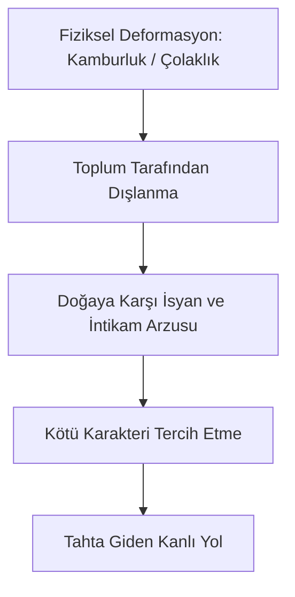

# Richard III: Machiavellian Güç ve Tudor Propagandası

William Shakespeare'in erken dönem tarih oyunlarından biri olan *Richard III* (yaklaşık 1592-1593), İngiliz tiyatrosunun en karizmatik, en acımasız ve en tiyatral kötü karakterini (villain) sunar. Oyun, Güller Savaşı'nın (Wars of the Roses) son dönemini ve Gloucester Dükü Richard'ın tahtı ele geçirmek için yürüttüğü kanlı entrikaları konu alır.

---

## 1. Sahnedeki Machiavellian Prens

Niccolò Machiavelli'nin *II Principe* (Prens) adlı eseri, hükümdarın iktidarını korumak için ahlak dışı yollara başvurabileceğini, korkulmanın sevilmekten daha güvenli olduğunu savunur. Shakespeare dönemi İngiltere'sinde "Machiavel" terimi, şeytani, ikiyüzlü ve fırsatçı politikacıları tanımlamak için kullanılıyordu.

- **Politik Tiyatro:** Richard, tam anlamıyla bir Machiavellian figürdür. İnançsız olmasına rağmen dindar taklidi yapar, düşmanlarını birbirine düşürür ve kurbanlarını sahte bir dostlukla kandırır. Taht yolundaki en büyük engellerden biri olan Lady Anne'i, babasını ve kocasını öldürmüş olmasına rağmen kurbanının cenazesinde ikna ederek onunla evlenmesi, onun manipülasyon gücünün kanıtıdır.
- **Kendi Ağzından İtiraf:** Richard, seyirciyle doğrudan konuşarak (soliloquy) ahlaki sınırları nasıl hiçe sayacağını açıkça ilan eder:
  > *"Madem ki aşkın tatlı sözleriyle vakit geçirecek bir aşık olamıyorum, / Ben de karar verdim bir hain olmaya, / Ve nefret etmeye bu günlerin boş eğlencelerinden."*  
  > — **Richard III, Perde I, Sahne I, Satır 30-32**

---

## 2. Bedensel Kusur ve Ahlaki Bozulma

Elizabeth dönemi inançlarına göre fiziksel engeller ve biçimsizlikler, kişinin ruhsal kötülüğünün ve Tanrı'nın lanetinin dışa vurumu olarak görülürdü.

- **Aynadaki Canavar:** Richard, doğuştan kambur, çolak ve çirkin bir yapıya sahiptir. O, bu bedensel durumu bir mazeret ve intikam gerekçesi olarak kullanır. Toplum onu dışladığı için, o da toplumsal ahlakı dışlar. Kendi çirkinliğini, dünyayı kendi çirkinlik düzeyine çekmek için bir araç haline getirir.

---

## 3. Tudor Propagandası ve Tarihsel Tahrifat

*Richard III*, estetik değerinin yanı sıra dönemin siyasi iktidarı olan Tudor Hanedanlığı'nı meşrulaştırmayı amaçlayan bir **propaganda** aracıdır.

- **Hanedan Meşruiyeti:** Kraliçe I. Elizabeth, tahtı Richard III'ü Bosworth Savaşı'nda yenen ve Tudor hanedanını kuran VII. Henry'nin (Richmond Kontu) torunudur. Shakespeare, tahtta bulunan kraliçeyi memnun etmek için Richard III'ü tarihsel gerçeklerin de ötesinde fiziksel bir canavar, çocuk katili ve tiran olarak resmetmiştir. Buna karşılık VII. Henry, İngiltere'yi bu tirandan kurtaran ve barışı getiren kutsal bir kurtarıcı olarak sunulur.

---

## 4. Richard'ın Çöküşü ve Yalnızlığı

Richard, tüm rakiplerini yok edip tahta çıktıktan sonra derin bir paranoya ve yalnızlığa gömülür. Bosworth Savaşı'ndan önceki gece, öldürdüğü kurbanların hayaletleri rüyasına girerek onu lanetler. Uyandığında vicdanıyla baş başa kalan Richard, oyun boyunca ilk kez zayıflık gösterir:

> *"Richard kendini seviyor mu? Hayır, neden sevsin ki? / Kendi kendime yaptığım kötülükler için kendimden nefret ediyorum. / Ben bir hainim... Hayır, yalan söylüyorum, değilim. / Kendini sever mi hiç bir hain? Ah hayır! Ben kendimden nefret ediyorum, / Kendimin yaptığı hainlikler yüzünden..."*  
> — **Richard III, Perde V, Sahne III, Satır 187-191**

Savaş meydanında atını kaybedip yapayalnız kaldığında attığı çığlık, tiranın çaresizliğini özetler:
> *"Bir at! Bir at! Krallığım bir at için!"*  
> — **Richard III, Perde V, Sahne IV, Satır 7**

---

## 5. Kaynaklar ve Akademik Atıflar

- **Tillyard, E. M. W.** *Shakespeare's History Plays*. Macmillan, 1944.
- **Machiavelli, Niccolò.** *The Prince*. Trans. Harvey C. Mansfield. University of Chicago Press, 1998.
- **Dollimore, Jonathan and Alan Sinfield.** *Political Shakespeare: Essays in Cultural Materialism*. Manchester University Press, 1985.
