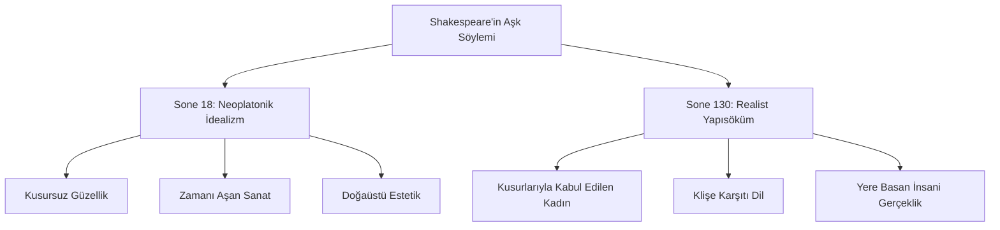

# Sone 18 ve Sone 130: İdeal Aşk ile Gerçekçi Sevginin Karşılaştırmalı Okuması

William Shakespeare'in soneleri arasında en çok tanınan ve birbirine taban tabana zıt iki edebi yaklaşımı temsil eden iki şiir **Sone 18** ("Shall I compare thee...") ve **Sone 130** ("My mistress' eyes...") soneleridir. Bu iki eserin analizi, Ozan'ın aşk kavramını nasıl hem yücelttiğini hem de gerçekçi bir zeminde yapı sökümüne uğrattığını gösterir.

---

## 1. Sone 18: Güzelliğin Sanatla Ölümsüzleştirilmesi

### Orijinal Metin ve Türkçe Çevirisi
| **Orijinal Metin** | **Türkçe Serbest Çevirisi** |
| :--- | :--- |
| *Shall I compare thee to a summer's day?* | Seni bir yaz gününe benzetebilir miyim? |
| *Thou art more lovely and more temperate:* | Sen ondan daha sevimli ve daha ılımlısın: |
| *Rough winds do shake the darling buds of May,* | Sert rüzgarlar sarsar Mayıs'ın o güzelim goncalarını, |
| *And summer's lease hath all too short a date:* | Hem yazın süresi de çok kısadır zaten: |
| *Sometime too hot the eye of heaven shines,* | Bazen göğün gözü (güneş) çok sıcak parıldar, |
| *And often is his gold complexion dimm'd;* | Ve çok kez soluklaşır o altın çehresi; |
| *And every fair from fair sometime declines,* | Ve her güzel güzelliğinden yitirir zamanla, |
| *By chance or nature's changing course untrimm'd;* | Rastlantıyla ya da doğanın değişen düzeniyle yıpranır; |
| *But thy eternal summer shall not fade* | Ama senin o sonsuz yazın asla solmayacak, |
| *Nor lose possession of that fair thou owest;* | Sahip olduğun o güzellik hiç eksilmeyecek; |
| *Nor shall Death brag thou wander'st in his shade,* | Ölüm senin kendi gölgesinde gezdiğinle övünemeyecek, |
| *When in eternal lines to time thou growest:* | Zamanın bağrında sonsuz satırlarla büyüdüğünde: |
| *So long as men can breathe or eyes can see,* | İnsanlar nefes alabildiği, gözler görebildiği sürece, |
| *So long lives this and this gives life to thee.* | Bu şiir yaşayacak ve sana hayat verecek her gece. |

### Yakın Okuma Analizi
- **Yaz Gününün Kusurları:** Şair, sevgilisini bir yaz gününe benzetmekle işe başlar ancak yaz mevsiminin kusurlarını sıralayarak onu aşar: Yaz çok kısadır, rüzgarlıdır, güneşi bazen kavurur, bazen bulutlarla kapanır.
- **Sonsuz Yaz:** Sevgilinin güzelliği ise değişmez ve bozulmaz bir "sonsuz yaz"dır. Ölüm bile onun üzerinde hak iddia edemez.
- **Meta-Poetik Çözüm:** Şiirin son iki dizesi, ölümsüzlüğün sırrını açıklar: Güzelliği koruyan şey doğa değil, şairin yazdığı bu satırlardır. Şiir okunduğu sürece sevgili yaşayacaktır.

---

## 2. Sone 130: Petrarkist Klişelerin Hicvedilmesi

### Orijinal Metin ve Türkçe Çevirisi
| **Orijinal Metin** | **Türkçe Serbest Çevirisi** |
| :--- | :--- |
| *My mistress' eyes are nothing like the sun;* | Sevgilimin gözleri güneşe hiç benzemez; |
| *Coral is far more red than her lips' red;* | Mercan çok daha kırmızıdır dudaklarının kırmızısından; |
| *If snow be white, why then her breasts are dun;* | Eğer kar beyazsa, göğüsleri grimsi esmerdir o zaman; |
| *If hairs be wires, black wires grow on her head.* | Saçlar tel gibi olsa, siyah teller büyür kafasında. |
| *I have seen roses damask'd, red and white,* | Katmerli güller gördüm, kırmızı ve beyaz, |
| *But no such roses see I in her cheeks;* | Ama öyle güller yok yanaklarında onun; |
| *And in some perfumes is there more delight* | Ve bazı parfümler çok daha fazla keyif verir |
| *Than in the breath that from my mistress reeks.* | Sevgilimin ağzından çıkan o nefesten. |
| *I love to hear her speak, yet well I know* | Konuşmasını dinlemeyi severim, ama iyi bilirim ki |
| *That music hath a far more pleasing sound;* | Müzik çok daha hoş tınlar onun sesinden; |
| *I grant I never saw a goddess go;* | İtiraf ederim, hiç görmedim bir tanrıça nasıl yürür; |
| *My mistress, when she walks, treads on the ground:* | Benim sevgilim ise yürürken basar yere: |
| *And yet, by heaven, I think my love as rare* | Yine de gökler şahit, eşsizdir benim aşkım, |
| *As any she belied with false compare.* | Sahte benzetmelerle kandırılan tüm o kadınlar kadar. |

### Yakın Okuma Analizi
- **Blazon Geleneğinin Eleştirisi:** Rönesans şiirinde (Petrarca etkisiyle) kadınları güneş, gül, inci, kar ve tanrıçalarla kıyaslayan abartılı övgü kalıbına (*blazon*) karşı Shakespeare bu sonesinde açıkça dalga geçer.
- **Gerçekçi Bir Portre:** Kadının gözleri parlak değildir, nefesi parfüm kokmaz, teni kar beyazı değil esmerdir, yürürken uçmaz, toprağa basar.
- **Volta (Dönüş):** Şiir ilk 12 dize boyunca kadının kusurlarını sıralar gibi görünse de son beyitte (`couplet`) büyük bir dönüş yaşanır: Şair, bu gerçek kadını, sahte benzetmelerle göklere çıkarılan ulaşılamaz hayali kadınlardan çok daha içten ve derin bir aşkla sevdiğini söyler. Gerçek sevgi dürüstlük gerektirir.

---

## 3. İdealist vs. Gerçekçi Aşk Karşılaştırması

Bu iki sone, Shakespeare'in poetik dehasının çok yönlülüğünü gösterir:

---

## 4. Kaynaklar ve Akademik Atıflar

- **Kerrigan, John.** *The Sonnets and A Lover's Complaint*. Penguin Books, 1986.
- **Innes, Paul.** *Class and Patronage in Shakespeare's Sonnets*. Patgrave Macmillan, 1997.
- **Halpern, Richard.** *The Poetics of Primitive Accumulation*. University of Minnesota Press, 1991.
