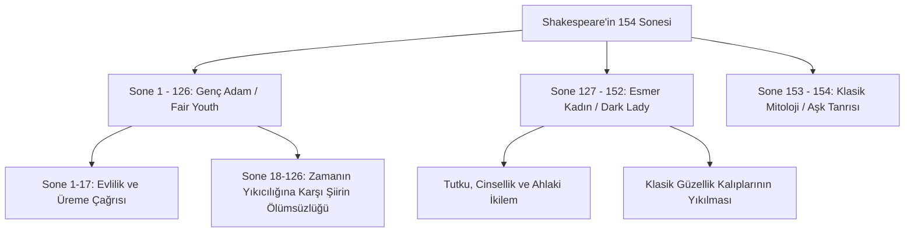

# Shakespearean Sone Yapısı ve Poetika

William Shakespeare'in 1609 yılında yayımlanan 154 sonelik derlemesi, İngiliz lirik şiirinin en önemli başyapıtlarından biridir. Ozan, bu sonelerde aşk, güzellik, ölüm, ihanet ve zamanın yıkıcılığı gibi evrensel temaları son derece disiplinli ve yenilikçi bir poetik yapıyla ele alır.

---

## 1. İngiliz (Shakespearean) Sone Yapısı

İtalyan (Petrarkist) sone yapısından farklı olarak geliştirilen İngiliz sonesi, Shakespeare'in kullanımıyla klasikliğe kavuştuğu için **Shakespearean Sone** olarak da adlandırılır.

- **Kafiye Düzeni ve Kıta Yapısı:** 14 satırdan oluşan şiir, üç dörtlük (quatrain) ve bir bitiş beytinden (couplet) oluşur:
  - **Dörtlük 1:** `a-b-a-b` (Temayı veya problemi ortaya koyar)
  - **Dörtlük 2:** `c-d-c-d` (Temayı geliştirir, örnekler sunar)
  - **Dörtlük 3:** `e-f-e-f` (Temaya yeni bir bakış açısı getirir veya çatışmayı derinleştirir)
  - **Bitiş Beyti:** `g-g` (Volta/dönüş noktasından sonra gelen epigrammatik özet; problemi çözer veya şaşırtıcı bir sonuca bağlar)

---

## 2. İambik Pentameter (Vezin)

Shakespeare'in şiirlerinde ve oyunlarındaki manzum bölümlerde kullandığı temel ölçü **İambik Pentameter**'dır (Beşli İambus Ölçüsü).

- **Ritmin Tanımı:** Her satır, sırasıyla vurgusuz ve vurgulu hecelerden oluşan beş hece çiftinden (toplamda 10 hece) meydana gelir. Bu ritim, kalp atışına veya doğal İngilizce konuşma temposuna en yakın ritimdir.
- **Ritmik Yapı:**
  `da-DUM | da-DUM | da-DUM | da-DUM | da-DUM`
- **Örnek Satır (Sone 18):**
  > *Shall **I** | com **pare** | thee **to** | a **sum** | mer's **day**?*

---

## 3. 154 Sonenin Tematik Gruplanışı

Soneler, hitap edilen kişilere ve temalarına göre üç ana gruba ayrılır:

### 1. Genç Adam Soneleri (Sone 1 – 126)
Bu şiirler, yüksek sınıftan, son derece yakışıklı genç bir erkeğe (*Fair Youth*) ithaf edilmiştir. 
- **1-17 (Üreme Soneleri):** Genci evlenmeye ve güzelliğini çocuk sahibi olarak ölümsüzleştirmeye çağırır.
- **18-126:** Şair ile genç adam arasındaki derin sevgiyi, platonik ve entelektüel aşkı ele alır. Zamanın yıkıcı gücü ve yaşlanma korkusu en baskın temalardır.

### 2. Esmer Kadın Soneleri (Sone 127 – 152)
Bu soneler, geleneksel sarışın/mavi gözlü güzellik idealine uymayan esmer, gizemli bir kadına (*Dark Lady*) yazılmıştır.
- **İçerik:** Genç adam sonelerindeki platonik aşkın aksine, burada yoğun bir cinsel tutku, sadakatsizlik, şehvet ve ahlaki pişmanlıklar ön plandadır. Şair, kadının kendisini aldattığını bilmesine rağmen ona duyduğu saplantılı arzuyu kontrol edemez.

### 3. Klasik Mitolojik Soneler (Sone 153 – 154)
Aşk tanrısı Cupid'e (Eros) atıfta bulunan, Yunan antolojisinden uyarlanmış allegorik sonelerdir.

---

## 4. Zaman (Devouring Time) ve Şiirin Gücü

Sonelerin en büyük felsefi teması, her şeyi yok eden amansız **Zaman**'dır (Devouring Time). Zaman, güzelliği soldurur, binaları yıkar, krallıkları devirir. Şair, bu kozmik canavara karşı direnebilecek tek bir güç tanımlar: **Kendi Şiiri**. Yazılan kelimeler, sevgilinin güzelliğini zamanın pençesinden kurtaracak ve onu sonsuza dek yaşatacaktır.

---

## 5. Kaynaklar ve Akademik Atıflar

- **Vendler, Helen.** *The Art of Shakespeare's Sonnets*. Harvard University Press, 1997.
- **Booth, Stephen.** *Shakespeare's Sonnets: Edited with Analytic Commentary*. Yale University Press, 1977.
- **Schoenfeldt, Michael.** *A Companion to Shakespeare's Sonnets*. Blackwell Publishing, 2007.
