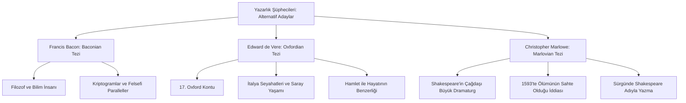

# Shakespeare'in Yazarlık Tartışmaları: İddialar ve Akademik Reddiyeler

William Shakespeare'in dünyaca ünlü oyunlarını ve şiirlerini aslında onun yazmadığı, "William Shakespeare" isminin paravan olarak kullanıldığı yönündeki iddialar, 19. yüzyılın ortalarından beri edebi ve akademik çevrelerde tartışılmaktadır. Bu çalışmada, yazarlık şüphelerinin (anti-Stratfordian tezler) ortaya çıkış nedenleri, öne sürülen alternatif adaylar ve çağdaş Shakespeare akademisinin bu tezlere verdiği kanıta dayalı akademik reddiyeler incelenmektedir.

---

## 1. Yazarlık Şüphelerinin Kökeni: Neden İnanmıyorlar?

Yazarlık tartışmalarını başlatan temel argümanlar şunlardır:

- **Eğitim Düzeyi ve Köken:** Stratford-upon-Avon'da bir deri tüccarının oğlu olarak doğan ve üniversite eğitimi almayan bir taşralının; hukuk, saray diplomasisi, yabancı diller, klasik mitoloji ve İtalya coğrafyası hakkında bu kadar derin bilgiye sahip oyunları nasıl yazabildiği sorusu.
- **Belge Eksikliği:** Shakespeare'in el yazısıyla yazılmış hiçbir oyun taslağının günümüze ulaşmamış olması ve özel mektuplarında veya günlüğünde oyun yazma sürecine dair hiçbir bilginin bulunmaması.
- **Kişisel Kütüphane:** Ölümünden sonra hazırlanan vasiyetnamesinde kitaplarından veya oyun taslaklarından tek bir kelime dahi bahsedilmemiş olması.

---

## 2. Öne Sürülen Başlıca Alternatif Adaylar

Şüpheciler (anti-Stratfordianlar), oyunların arkasında yüksek eğitimli, saray yaşamına aşina, seyahat etmiş bir aristokratın veya entelektüelin bulunduğunu savunurlar. En popüler adaylar şunlardır:

### 1. Francis Bacon (Baconian Teorisi)
- **Argüman:** Filozof, devlet adamı ve hukukçu Francis Bacon'ın geniş entelektüel birikimi oyunlardaki felsefi ve hukuki derinlikle örtüşmektedir. Destekçileri, oyunların içine gizlenmiş şifreler (kriptogramlar) olduğunu iddia ederler.

### 2. Edward de Vere, 17th Earl of Oxford (Oxfordian Teorisi)
- **Argüman:** En popüler teoridir. Oxford Kontu, İtalya'yı gezmiş, saray entrikalarını yakından yaşamış, sanatı destekleyen bir aristokrattır. Hayatındaki bazı olaylar (örneğin kayınpederi Lord Burghley ile ilişkisi), *Hamlet* oyunundaki Polonius-Hamlet çatışmasıyla şaşırtıcı benzerlikler gösterir.

### 3. Christopher Marlowe (Marlovian Teorisi)
- **Argüman:** Shakespeare ile aynı yıl doğan dahi oyun yazarı Marlowe'un 1593'teki bir meyhane kavgasında ölümünün düzmece olduğu; devlet casusu olduğu için gizlenerek eserlerini Shakespeare adıyla yazmaya devam ettiği iddia edilir.

---

## 3. Akademik Konsensüs ve Stratfordian Reddiyeler

Çağdaş akademisyenlerin ve tarihçilerin ezici çoğunluğu (Stratfordianlar), yazarlık iddialarını komplo teorisi olarak değerlendirir ve reddeder. Kanıtlar şunlardır:

### 1. Tarihsel ve Belgesel Kanıtlar
Shakespeare'in oyun yazarı olduğuna dair çağdaşı olan diğer yazarlardan, tiyatro ortaklarından ve resmi kurumlardan gelen sayısız tarihi belge vardır:
- **Resmi Kayıtlar:** Kıraliyet sarayındaki ödemeler, telif kayıtları (Stationers' Register) ve tiyatro topluluğunun yasal belgelerinde adı açıkça geçmektedir.
- **Ben Jonson'ın Tanıklığı:** Shakespeare'in en yakın dostu ve rakibi olan şair Ben Jonson, 1623 tarihli *First Folio* (İlk Folyo) baskısının önsözünde onu bizzat tanımış biri olarak anar ve ona *"Sweet Swan of Avon"* (Avon'un Tatlı Kuğusu) diye hitap eder. Jonson ayrıca onun *"az Latince ve daha az Yunanca"* bildiğini belirterek eğitim düzeyini de doğrular.

### 2. Dönemin Eğitim Sistemi
Stratford Gramer Okulu (*King's New School*), dönemin standartlarına göre son derece ağır bir klasik eğitim vermekteydi. Öğrenciler haftanın 6 günü sabahtan akşama kadar Latince çeviri, retorik, Roma tarihi ve edebiyatı (Ovidius, Vergilius, Seneca, Terence) çalışıyorlardı. Bu eğitim, üniversiteye gitmeyen birinin de bu oyunları yazacak kültürel birikimi edinmesi için tamamen yeterliydi.

### 3. Oyunlardaki Coğrafi ve Tarihi Hatalar
Oyunlarda, aristokrat bir adayın yapmayacağı türden bariz coğrafi ve tarihi hatalar vardır:
- *Kış Masalı* oyununda tamamen kara parçası olan Bohemya'ya bir deniz kıyısı atfedilir.
- *Julius Caesar* oyununda, Antik Roma'da henüz icat edilmemiş olan mekanik saatlerin çaldığından bahsedilir (anakronizm).
- Oxford Kontu Edward de Vere 1604 yılında ölmüştür; ancak Shakespeare'in *Fırtına*, *Macbeth* ve *Kral Lear* gibi geç dönem oyunları bu tarihten sonra gerçekleşen güncel tarihi olaylara (örneğin 1605 Barut Komplosu veya 1609 Bermuda gemi kazası) atıfta bulunur.

---

## 4. Sonuç

Yazarlık tartışmaları, genellikle elitist bir yaklaşımdan beslenmektedir. Taşralı ve orta sınıf bir esnaf oğlunun böyle dehalar yaratamayacağı ön kabulü, tarihsel gerçeklerle uyuşmamaktadır. Shakespeare, tiyatronun içinden gelen bir uygulayıcı olarak, sahne dinamiklerini en iyi bilen pratik bir sanatçıdır ve oyunlarının başarısı da onun bu sahne tecrübesinde yatmaktadır.

---

## 5. Kaynaklar ve Akademik Atıflar

- **Shapiro, James.** *Contested Will: Who Wrote Shakespeare?*. Simon & Schuster, 2010.
- **Bate, Jonathan.** *The Genius of Shakespeare*. Oxford University Press, 1998.
- **Schoenbaum, S.** *William Shakespeare: A Compact Documentary Life*. Oxford University Press, 1977.
