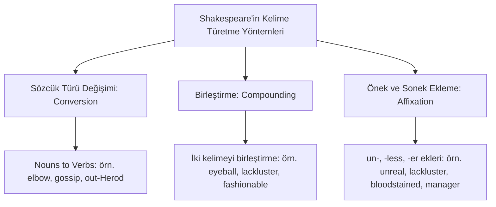

# Shakespeare'in Dil Mirası: Neolojizmler ve Retorik Deha

William Shakespeare, Erken Modern İngilizcenin (Early Modern English) gelişim sürecinde dile en çok katkı sunan yazardır. İngilizcenin henüz tam olarak standartlaşmadığı, esnek ve gelişime açık olduğu bir dönemde yazan Ozan; sözcük dağarcığı, deyimler ve retorik figürler açısından dile devasa bir miras bırakmıştır.

---

## 1. Neolojizmler: İngilizceye Kazandırılan +1700 Kelime

Oxford İngilizce Sözlüğü (OED), İngilizcede ilk kez Shakespeare'in oyunlarında veya şiirlerinde yazılı olarak kullanılan 1700'den fazla sözcük tespit etmiştir. Shakespeare bu kelimeleri çeşitli yöntemlerle türetmiştir:

### Örnek Kelimeler ve İlk Geçtiği Oyunlar
- **Assassination** (Suikast) - *Macbeth* oyununda ilk kez kullanılmıştır.
- **Lonely** (Yalnız) - *Coriolanus* oyununda türetilmiştir.
- **Majestic** (Görkemli) - *Fırtına* oyununda yer alır.
- **Dwindle** (Küçülmek/Azalmak) - *Henry IV* oyununda ilk kez geçer.
- **Hurry** (Acele etmek) - *Comedy of Errors* oyununda türetilmiştir.

---

## 2. Retorik Figürler ve Dil Oyunları

Shakespeare'in metinleri, Rönesans retorik eğitiminin tüm zenginliğini yansıtır. En sık kullandığı retorik figürler şunlardır:

### 1. Hendiadys (İki Sözcükle Tek Anlam)
Tek bir karmaşık fikri, sıfat tamlaması yerine, aralarına "ve" (and) bağlacı koyarak iki isimle ifade etme sanatıdır. Shakespeare özellikle olgunluk dönemi tragedyalarında bu figüre çok sık başvurur.
- *Furious sound* (Öfkeli ses) yerine, *Sound and fury* (Gürültü ve öfke - *Macbeth*).
- *Distant land* (Uzak diyar) yerine, *The whip and spur of my free will* (*Measure for Measure*).

### 2. Malapropizm (Sözcük Karıştırma)
Karakterlerin (genellikle alt sınıftan veya komik karakterlerin) kelimeleri yanlış ama kulağa benzer sözcüklerle karıştırarak komik duruma düşmesidir. Bu terim daha sonra edebi bir terim haline gelmiştir.
- *Dogberry* (*Kuru Gürültü* oyununda) sürekli kelimeleri karıştırır: Örneğin, *"protest"* yerine *"prostitute"* der veya *"examination"* yerine *"excommunication"* sözcüğünü kullanır.

---

## 3. Günlük Dile Geçen Deyimler

Shakespeare'in oyunlarında karakterlerine söylettiği pek çok ifade, bugün modern İngilizcenin en yaygın kullanılan deyimleri (idioms) haline gelmiştir:

- **Break the ice** (Buzları eritmek) - *Hırçın Kız* (The Taming of the Shrew)
- **Heart of gold** (Altın kalp) - *Henry V*
- **Wild goose chase** (Boşuna çabalama) - *Romeo ve Juliet*
- **Love is blind** (Aşkın gözü kördür) - *Venedik Taciri* (The Merchant of Venice)
- **In a pickle** (Zor durumda kalmak) - *Fırtına* (The Tempest)

---

## 4. Semantik Yapı ve Erken Modern İngilizce

Shakespeare'in dili, Orta İngilizce (Geoffrey Chaucer dönemi) ile Modern İngilizce arasındaki köprüdür. 
- **Zamirlerin Kullanımı:** Samimiyet belirten *"thou/thee/thy"* ile resmiyet/saygı belirten *"you/your"* arasındaki semantik farkı, karakterler arasındaki sınıf farkını ve duygusal yakınlığı göstermek için mükemmel bir biçimde kullanır.
- **Esnek Dilbilgisi:** Kelimelerin cümle içindeki yerlerini değiştirerek ve dilbilgisi kurallarını esneterek şiirsel ritme (vezin) uyum sağlar.

---

## 5. Kaynaklar ve Akademik Atıflar

- **Crystal, David.** *Think on My Words: Exploring Shakespeare's Language*. Cambridge University Press, 2008.
- **Kermode, Frank.** *Shakespeare's Language*. Farrar, Straus and Giroux, 2000.
- **McDonald, Russ.** *Shakespeare and the Arts of Language*. Oxford University Press, 2001.
